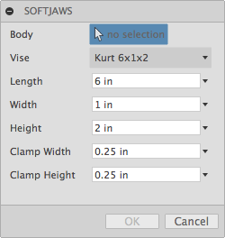
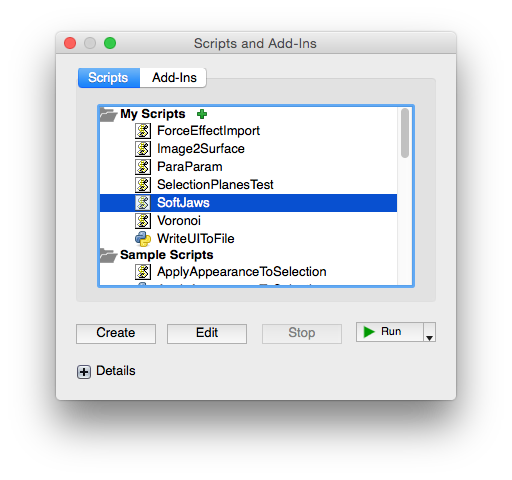

#  Fusion360SoftJaws

This script is used for creating a set of "soft jaws" for a hold a part to be machined.

## Installation

Copy the "Fusion360SoftJaws" folder into your Fusion 360 "My Scripts" folder. You may find this folder using the following steps:

1. Start Fusion 360 and then select the File -> "Scripts and Add-Ins..." menu item
2. The Scripts and Add-Ins dialog will appear and display the "My Scripts" and "Sample Scripts" folders
3. Select one of the "My Scripts" files and then click on the "+" Details icon near the bottom of the dialog.
  - If there are no files in the "My Scripts" folder then create a default one by clicking the Create button, select JavaScript, and then OK.
4. With a user script selected and the "Details" section expanded, look at the Full Path value.  This contains the location of the user scripts folder.
5. Copy this script's folder into that location.
  For example, on my Mac the folder is located in:
    /Users/USERNAME/Library/Application Support/Autodesk/Autodesk Fusion 360/API/Scripts
  And on Windows:
    C:\users\USERNAME\AppData\Roaming\Autodesk\Autodesk Fusion 360\API\Scripts
6. Now add the script to the lists of "My Scripts"
7. Click the "+" icon next to the "my Scripts" item
  - The "Add new script" dialog should appear.
8. Locate the Fusion360SoftJaws.js file in the folder you copied, select it, and click Open. The script should now be installed and ready to be run.

The script should be ready to run.

## Usage

1. Run the "SoftJaws" script from the Script Manager
2. The settings dialog will be shown.  Adjust to your preferences:

  

  - Body : Select the body the soft jaws will hold
  - Vise : Select a specific vise to populate dimensions below
  - Length : Length (x) of soft jaws
  - Width : Width (y) of soft jaws
  - Height : Height (z) of soft jaws
  - Clamp Width : Width of shelf to hold body
  - Clamp Height : Height of shelf to hold body
3. Click OK to begin

Note, after the script has run the design changes may be undone using Edit -> Undo.

### Example Usage

Here is an example of using the script to create a set of soft jaws for a design.

1. Start Fusion 360
2. Open a design containing the part the soft jaws will hold
3. Run the SoftJaws (Javascript) script from the Script Manager.

  

4. The settings dialog will be shown.

  

5. TODO
4. Click OK to start the ball rolling

## TODO
- Load the list of vise models and values from an external user editable txt file.
- Integrate "foundary fill" operation once exposed through API.
- Add automatic splitting of soft jaws body after boundary fill operation
- Add mounting holes to the soft jaws

## Issues

- The script uses the Boundary Fill command which is not part of the API. But it can be run as a "command". But this will stop the soft jaws command (script) from running. Therefore the need to manually split the soft jaws after performing the boundary fill.
- Selecting a vise from the list of "Vise" models doesn't always change the other values in the dialog.
